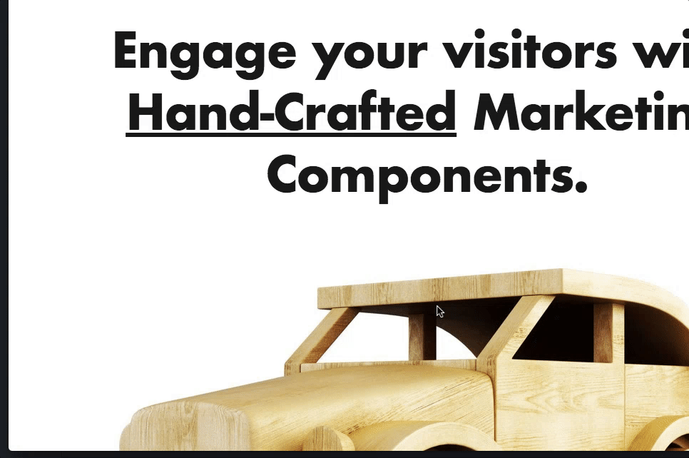

# Marketing.js

Calls-to-Action that change the way your website interacts with others.

Calls-to-Action
===============
- [x] **Wizard** - single or multi step forms - [Example](./ctas/wizard/index.html)
- [x] **Social Shares** - social icons - [Example](./ctas/chat/index.html)
- [x] **Live Chat** - chat with your visitors - [Example](./ctas/chat/index.html)
- [x] **Cookie Notice** - display a cookie notice - [Example](./ctas/cookie-notice/index.html)
- [x] Contact Form
- [ ] Call Me Back
- [ ] Survey
- [ ] Button Link
- [ ] Petition
- [ ] Poll
- [ ] Appointment Booker
- [ ] Shopping Cart
- [ ] Cobrowsing

Actions
=======
- [ ] Join Newsletter
- [ ] Free Download
- [ ] Start Sequence of Events (eg. Course)
- [ ] Redirect to URL
- [ ] Statement
- [ ] Become a Member
- [ ] Purchase a Product

Here's a chat in action:



To use a CTA, simply:

```
<script type="text/javascript" src="/path/to/marketing.js"></script>
<script type="text/javascript">
    new Marketing.Chat({
        data: {
            messages: {},
            user: {},
            agent: {},
            appendTo: '.chat'
        },
        api: { // required to interact with a server
            identify: function identify() {},
            track: function track(eventName, data) {}
        }
    }).ready();
</script>
```

CTAs may require other details &mdash; check the examples above.
